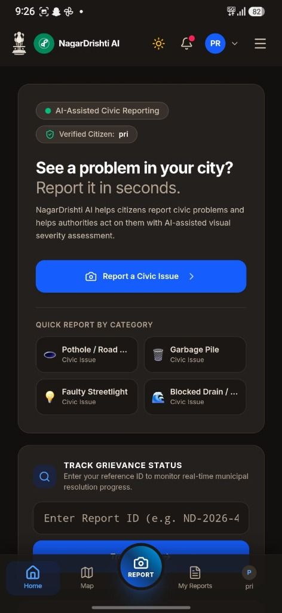
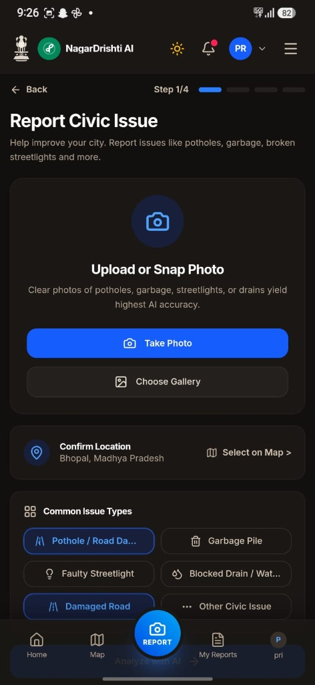
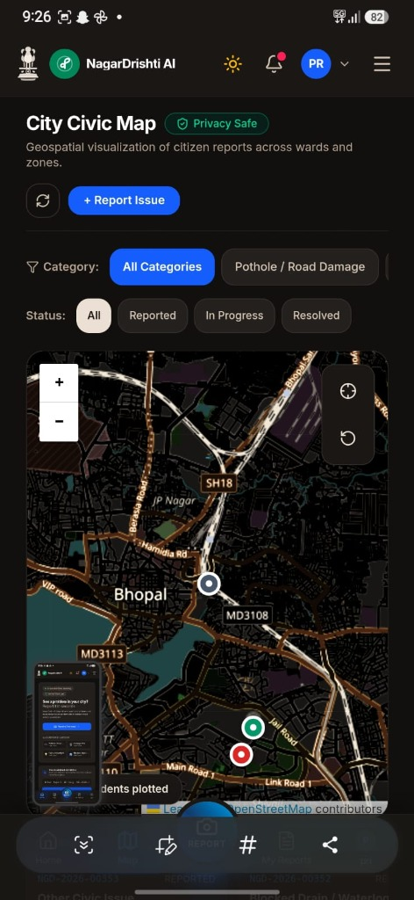
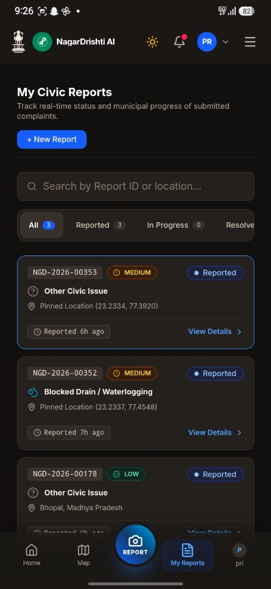
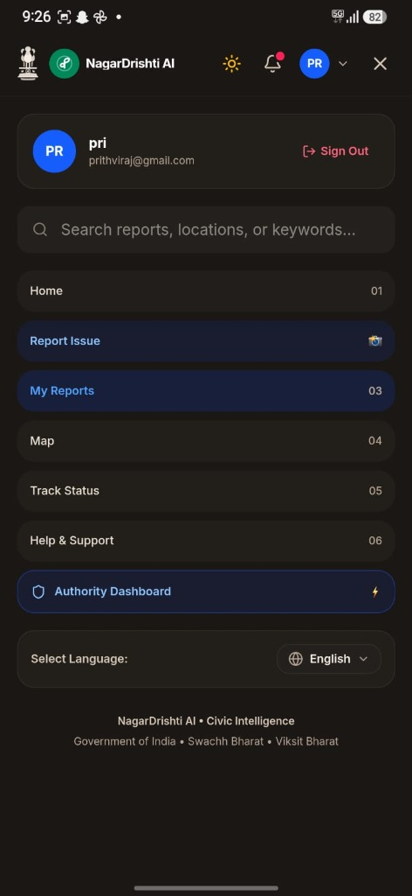
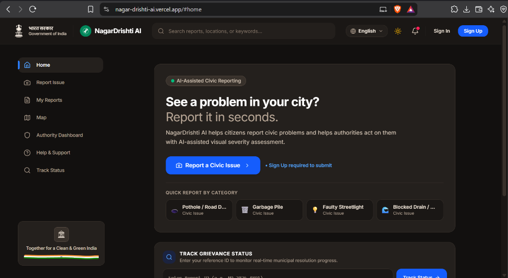
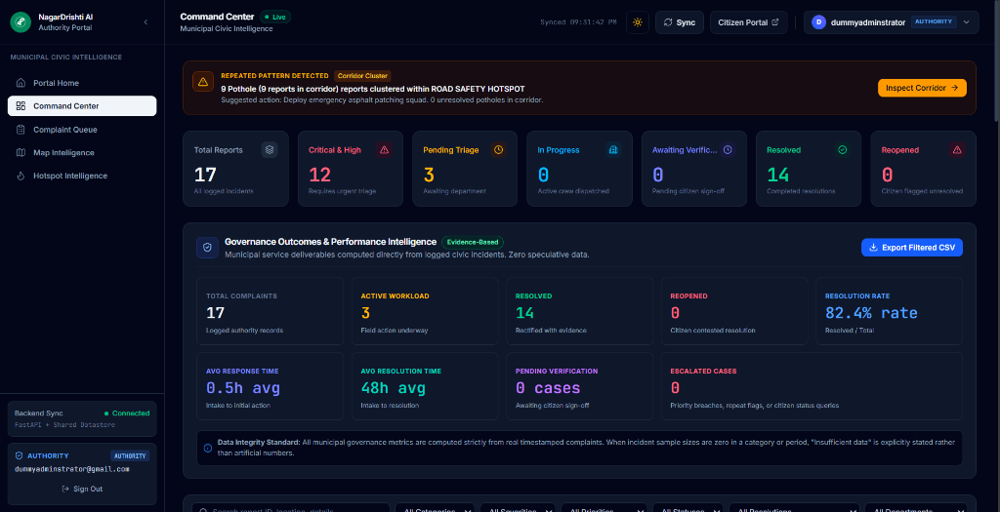
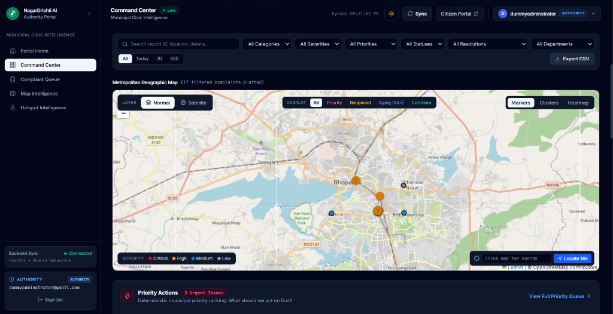

# NagarDrishti AI

### AI-Powered Civic Issue Reporting & Municipal Governance Intelligence Platform

<p align="center">
  <a href="https://nagar-drishti-ai.vercel.app/"><b>🌐 Citizen Web Portal (Live)</b></a> &nbsp;•&nbsp;
  <a href="https://nagardrishti-ai-authority.vercel.app/"><b>🏛️ Authority Command Center (Live)</b></a> &nbsp;•&nbsp;
  <a href="https://github.com/prithvirajsingh11/NagarDrishti-AI-Hackathon/raw/main/citizen-portal/app-debug.apk"><b>📱 Download Android APK (Direct)</b></a>
</p>

---

### 🚀 Live Deployments & Applications

| Platform | Deployment Type | Live URL / Asset |
|---|---|---|
| 🌐 **Citizen Portal (Live Web Preview)** | Production Web App (Vercel) | [**https://nagar-drishti-ai.vercel.app/**](https://nagar-drishti-ai.vercel.app/) *(Try app instantly in browser)* |
| 🏛️ **Authority Command Center (Live Web)** | Production Administrative Portal (Vercel) | [**https://nagardrishti-ai-authority.vercel.app/**](https://nagardrishti-ai-authority.vercel.app/) |
| 📱 **Citizen Mobile App (Android APK)** | Native Android Application (Capacitor) | [**Direct Download `app-debug.apk`**](https://github.com/prithvirajsingh11/NagarDrishti-AI-Hackathon/raw/main/citizen-portal/app-debug.apk) *(10.4 MB)* |

> 📱 **How to Test the Mobile App:**  
> - **Instant Browser Test:** Open the [**Citizen Web Portal**](https://nagar-drishti-ai.vercel.app/) — it runs the identical mobile-responsive PWA interface, camera intake, and AI analysis workflow in any browser.
> - **Android Device Installation:** Click [**Direct Download `app-debug.apk`**](https://github.com/prithvirajsingh11/NagarDrishti-AI-Hackathon/raw/main/citizen-portal/app-debug.apk) to download and install on any Android phone or emulator. Full Android Studio project source is at [`citizen-portal/frontend/android/`](citizen-portal/frontend/android/).

### 📱 Mobile Application Previews (Android App in Action)

| 1. Home Dashboard | 2. Snap / Report Issue | 3. City Civic Map | 4. Track My Reports | 5. Navigation & Profile |
|:---:|:---:|:---:|:---:|:---:|
|  |  |  |  |  |
| *One-tap AI issue reporting* | *Camera & GPS intake* | *Geospatial ward heatmap* | *Real-time SLA status* | *Language & Auth RBAC* |

---

> **Hackathon Submission Notice:**  
> This repository consolidates **TWO independent, production-grade applications** into a single source-code submission for hackathon evaluation:
> 1. **Citizen Portal** (`citizen-portal/`): [github.com/prithvirajsingh11/NagarDrishti-AI](https://github.com/prithvirajsingh11/NagarDrishti-AI)
> 2. **Municipal Authority Portal** (`authority-portal/`): [github.com/prithvirajsingh11/NagarDrishti-AI-Authority](https://github.com/prithvirajsingh11/NagarDrishti-AI-Authority)
>
> **Important Deployment Context:**  
> Both applications remain completely independent systems. Their existing production deployments and original repositories remain active and unchanged. This consolidated repository exists solely as a unified evaluation workspace for hackathon judges to inspect the complete end-to-end architecture, source code, and automated test suites.

---

### 🏛️ Standalone Project Repositories

| Application | Role | Original Git Repository |
|---|---|---|
| **Citizen Portal** | Public Web & Android App for civic issue reporting | [prithvirajsingh11/NagarDrishti-AI](https://github.com/prithvirajsingh11/NagarDrishti-AI) (`https://github.com/prithvirajsingh11/NagarDrishti-AI.git`) |
| **Municipal Authority Portal** | Administrative Command Center, GIS intelligence & squad dispatch | [prithvirajsingh11/NagarDrishti-AI-Authority](https://github.com/prithvirajsingh11/NagarDrishti-AI-Authority) (`https://github.com/prithvirajsingh11/NagarDrishti-AI-Authority.git`) |

---

## 1. Project Overview

**NagarDrishti AI** is a closed-loop civic intelligence platform engineered to eliminate opacity, triage bottlenecks, and delays in municipal defect resolution.

Traditional civic complaint systems suffer from high reporting friction, vague issue descriptions, incorrect department routing, and complete lack of post-repair accountability. NagarDrishti AI transforms this paradigm:

- **For Citizens:** Instant, zero-friction reporting via multimodal AI computer vision. Citizens snap a photograph; the AI identifies the defect category, estimates visual severity, tags precise GPS/map location, and predicts the responsible municipal department. Citizens review and confirm before submission.
- **For Municipal Authorities:** A centralized operational command center with real-time intake queues, GIS corridor heatmaps, algorithmic priority scoring (factoring AI severity, aging, clustering, and reopen penalties), squad dispatch, and confidential internal DLP notes.
- **Closed-Loop Accountability:** Repairs require photographic evidence uploaded by field crews. The lifecycle only terminates when the reporting citizen personally inspects the evidence and confirms resolution, with automatic escalation if the citizen reopens an inadequate repair.

---

## 2. Citizen Portal

> **Standalone Repository:** [`https://github.com/prithvirajsingh11/NagarDrishti-AI.git`](https://github.com/prithvirajsingh11/NagarDrishti-AI)

The **Citizen Portal** (`citizen-portal/`) delivers a mobile-first and web experience for civic defect reporting and tracking:

- **AI Vision Intake:** Analyzes uploaded or captured photos with Google Gemini Multimodal Vision to extract defect categories (potholes, garbage dumps, broken streetlights, open drains, water leakage), confidence levels, and visual severity scores (LOW, MEDIUM, HIGH, CRITICAL).
- **Interactive Location Pinning:** Captures device GPS with fallback to an interactive Leaflet/OpenStreetMap pin selector.
- **Citizen Confirmation & Edit:** Citizens review and confirm AI detections prior to submission, guaranteeing user control.
- **My Reports & Civic Timeline:** Real-time personal issue tracker with audit trails, milestone badges, and in-app event notifications.
- **Civic Discovery Map:** Explores community-reported issues nearby with privacy-preserving coordinate fuzzing.
- **Public Status Tracker:** Tokenless public tracker (`/api/complaints/{id}/public-summary`) with strict PII scrubbing.
- **Mobile Foundation:** Integrated with Capacitor (`@capacitor/core`, `@capacitor/android`) for native Android execution alongside the responsive web app.

#### 🌐 Citizen Web Portal (Live Production Interface)


---

## 3. Municipal Authority Portal

> **Standalone Repository:** [`https://github.com/prithvirajsingh11/NagarDrishti-AI-Authority.git`](https://github.com/prithvirajsingh11/NagarDrishti-AI-Authority)

The **Municipal Authority Portal** (`authority-portal/`) is the operational command center for municipal administrators, zonal engineers, and dispatchers:

- **Operational Command Center:** Real-time KPI dashboard, 6-stage Civic Lifecycle Pipeline ribbon, and multi-horizon filtering (24h, 7d, 30d, All).
- **GIS Map Intelligence:** Interactive Leaflet map with defect clusters, severity-coded pins, India-wide coordinate viewport, and Bhopal default center.
- **Algorithmic Priority Scoring:** Deterministic 0–100 urgency score with transparent rationale breakdowns (visual severity + complaint aging + spatial clustering + citizen reopen penalties).
- **Complaint Queue & Triage Drawer:** Deep case inspection with before/after visual comparisons, assignment history, and dispatch instructions.
- **Squad Dispatch:** Role-based municipal routing to responsible departments (Roads & Infrastructure, Solid Waste Management, Electrical & Street Lighting, Water Supply & Sewerage, Public Health).
- **Confidential Internal Notes:** Officer-only internal notes strictly isolated from public and citizen API responses.
- **Citizen Inquiry Management:** Officer acknowledgment of status inquiries without premature lifecycle state mutations.
- **Escalation Center:** Automated queue surfacing citizen-reopened cases, SLA aging breaches, and unresolved complaints.
- **Evidence-Based Resolution:** Mandatory repair photograph upload before marking any complaint as `RESOLVED`.
- **Governance Analytics & CSV Export:** Verified First-Time Resolution Rate, Citizen Verification Rate, and workload analytics with role-protected CSV export.

#### 🏛️ Municipal Authority Command Center (Live Operational View)


#### 🗺️ Metropolitan Geographic Map & Hotspot Intelligence


---

## 4. Complete Civic Lifecycle

```text
Photo Capture / Upload
        │
        ▼
   AI Analysis
        │
        ▼
Category + Confidence + Visual Severity
        │
        ▼
   Suggested Department
        │
        ▼
Location Tagging (GPS / Map Pin)
        │
        ▼
  Citizen Confirmation
        │
        ▼
Complaint Submission (NGD-XXXX-XXXXX)
        │
        ▼
Authority Priority Queue (0–100 Score)
        │
        ▼
   GIS Intelligence & Corridor Clustering
        │
        ▼
Department & Squad Assignment
        │
        ▼
   Field Action & Repair
        │
        ▼
Resolution Evidence (Photo Proof Upload)
        │
        ▼
Citizen Verification
        │
   ┌────┴───────────────────────────┐
   ▼                                ▼
Confirm Resolution            Reopen with Reason
   │                                │
   ▼                                ▼
CASE CLOSED                   Escalation Center (Priority Spike)
```

---

## 5. System Architecture

Both portals function as decoupled web/mobile frontends operating on a unified civic workflow and data contract:

```text
       Citizen Portal                                 Authority Portal
  (Web App / Capacitor Mobile)                   (Administrative Command Center)
               │                                                 │
               ▼                                                 ▼
        React 19 + Vite                                   React 19 + Vite
               │                                                 │
               └───────────────────────┬─────────────────────────┘
                                       │
                                       ▼
                     Shared Civic Backend / Civic Workflow
                             (FastAPI / Python)
                                       │
                      ┌────────────────┴────────────────┐
                      ▼                                 ▼
                  AI Vision                       Supabase Cloud
          (VisionAnalyzer Strategy)        ┌───────────────────────────┐
                      │                    │ • PostgreSQL Database     │
            ┌─────────┴─────────┐          │ • Row Level Security (RLS)│
            ▼                   ▼          │ • Private Image Storage   │
      Gemini Provider     Local Provider   │ • Supabase Auth (JWT)     │
    (Google GenAI SDK)      (Fallback)     └───────────────────────────┘
```

> **Architecture Decoupling:** Each frontend maintains isolated routing, view models, and styling tokens while sharing identical complaint schema types and API contracts.

---

## 6. Repository Structure

```text
NagarDrishti-AI-Hackathon/
├── citizen-portal/                  # Citizen Web & Mobile Application
│   │                                # Standalone: https://github.com/prithvirajsingh11/NagarDrishti-AI.git
│   ├── backend/                     # FastAPI Civic API Gateway & Services
│   │   ├── app/                     # API routers, core config, schemas, services
│   │   ├── data/                    # Local seed / backup database
│   │   ├── tests/                   # 93 automated tests across 8 suites
│   │   └── requirements.txt         # Python dependencies
│   ├── frontend/                    # React 19 + TypeScript + Vite + Tailwind CSS v4
│   │   ├── android/                 # Capacitor Android native wrapper
│   │   ├── src/                     # UI components, pages, context, services
│   │   └── package.json             # Frontend dependencies
│   ├── supabase/                    # SQL migrations and RLS security policies
│   ├── docs/                        # Architecture, feature matrix, demo script
│   ├── app-debug.apk                # Pre-built Android debug APK
│   └── README.md                    # Citizen Portal detailed documentation
│
├── authority-portal/                # Municipal Authority Command Center
│   │                                # Standalone: https://github.com/prithvirajsingh11/NagarDrishti-AI-Authority.git
│   ├── backend/                     # FastAPI Authority API & RBAC services
│   │   ├── app/                     # Routers, models, auth, store services
│   │   ├── tests/                   # 40 backend test cases
│   │   └── requirements.txt         # Python dependencies
│   ├── frontend/                    # React 19 + TypeScript + Vite + Tailwind CSS v4
│   │   ├── src/                     # Command Center, GIS maps, triage drawer
│   │   ├── test/                    # 51 Vitest test cases
│   │   └── package.json             # Frontend dependencies
│   ├── docs/                        # Architecture, feature matrix, demo script
│   └── README.md                    # Authority Portal detailed documentation
│
├── .gitignore                       # Root ignore rules for secrets, builds & caches
├── .gitattributes                   # Text file line normalization
└── README.md                        # Master hackathon submission documentation
```

---

## 7. Live Demo Links & Applications

> **Deployment Note:** The live deployments are hosted and continuously deployed from the original standalone repositories. The links below reflect the active production deployments:

### 🌐 Citizen Portal (Live Web)
👉 [**https://nagar-drishti-ai.vercel.app/**](https://nagar-drishti-ai.vercel.app/)

### 🏛️ Municipal Authority Portal (Live Web)
👉 [**https://nagardrishti-ai-authority.vercel.app/**](https://nagardrishti-ai-authority.vercel.app/)

### 📱 Citizen Android Mobile Application (APK)
👉 [**Direct Download `app-debug.apk`**](https://github.com/prithvirajsingh11/NagarDrishti-AI-Hackathon/raw/main/citizen-portal/app-debug.apk) *(10.4 MB pre-compiled APK)*
* Built using Capacitor native Android shell (`@capacitor/android`)
* Direct download link bypasses GitHub blob viewer
* Full Android Studio project source: [`citizen-portal/frontend/android/`](citizen-portal/frontend/android/)
* Features camera capture, location tagging, offline submission support, and responsive UI

---

## 8. Technology Stack

| Layer | Citizen Portal | Municipal Authority Portal |
|---|---|---|
| **Frontend Framework** | React 19, TypeScript | React 19, TypeScript |
| **Build & Tooling** | Vite, Tailwind CSS v4 | Vite, Tailwind CSS v4 |
| **Icons & Visuals** | Lucide React | Lucide React |
| **GIS & Mapping** | Leaflet, OpenStreetMap tiles | Leaflet, OpenStreetMap tiles, cluster views |
| **Data Visualization** | Recharts (impact stats) | Recharts (intake curves, aging, workload) |
| **Mobile Runtime** | Capacitor Android Native Shell | — (Desktop / Tablet responsive web) |
| **Backend Runtime** | Python 3.10+ / FastAPI / Uvicorn | Python 3.11+ / FastAPI / Uvicorn |
| **AI Vision Engine** | Google Gemini Multimodal (`gemini-2.5-flash` via `google-genai` SDK) + Offline Fallback | Interfaces with AI-analyzed severity & categories |
| **Identity & Database** | Supabase Auth (JWT), PostgreSQL with RLS | Supabase Auth (RBAC `authority` role check) |
| **Object Storage** | Supabase Storage (`complaint-images`) | Supabase Storage (`resolution-images`) |

---

## 9. Security & Privacy Guarantees

1. **Role-Based Access Control (RBAC):** All administrative and triage operations require authenticated Supabase JWT sessions verifying the `authority` role. Citizen tokens are strictly restricted to their own submitted cases.
2. **Confidential Internal Notes Isolation:** Authority internal notes, dispatcher instructions, and audit metadata are stripped server-side from all citizen and public API responses.
3. **Private Encrypted Image Storage:** Complaint and resolution photos are stored in private Supabase buckets and served via authenticated streaming proxy endpoints, eliminating public URL enumeration.
4. **PII-Safe Public Tracking:** The public status tracking endpoint (`/api/complaints/{id}/public-summary`) redacts citizen names, email addresses, phone numbers, precise GPS coordinates, internal notes, and auth tokens.
5. **Zero Client Secrets:** Client bundles contain only public anonymous keys (`VITE_SUPABASE_ANON_KEY`). Privileged service-role keys and Gemini API keys remain strictly on the backend.
6. **Strict CORS Policy:** Backend services explicitly enforce origin whitelists in production environments.

---

## 10. Automated Testing & Quality Gates

The consolidated codebase includes **184 automated tests** across both portals:

### Citizen Portal Verification
- **Backend Tests (93 tests across 8 suites):**
  ```bash
  cd citizen-portal/backend
  pytest -v
  ```
  *Covers API contracts, severity scoring, department resolution, JWT authentication, resolution lifecycle, citizen experience, civic discovery, and cross-repo lifecycle.*
- **Frontend Code Quality:**
  ```bash
  cd citizen-portal/frontend
  npm run lint    # Oxlint - 0 errors
  npm run build   # TypeScript compilation & production Vite bundle
  ```

### Authority Portal Verification
- **Backend Tests (40 test cases):**
  ```bash
  cd authority-portal/backend
  python -m unittest discover tests
  ```
  *Covers RBAC enforcement, confidential note redaction, lifecycle flow, division-by-zero safety, and CSV export.*
- **Frontend Tests (51 Vitest test cases):**
  ```bash
  cd authority-portal/frontend
  npm test -- --run
  ```
  *Covers GIS map robustness, mutation error handling, drawer states, and cross-repo data compatibility.*

---

## 11. Documentation Index

Detailed architectural blueprints, hackathon demo scripts, and feature guides are available in the respective project directories:

### Citizen Portal Documentation
- [Citizen System Architecture](file:///citizen-portal/docs/ARCHITECTURE.md) (`citizen-portal/docs/ARCHITECTURE.md`)
- [Citizen Features Matrix](file:///citizen-portal/docs/FEATURES.md) (`citizen-portal/docs/FEATURES.md`)
- [Citizen 2.5-Minute Demo Script](file:///citizen-portal/docs/DEMO_SCRIPT.md) (`citizen-portal/docs/DEMO_SCRIPT.md`)
- [Citizen Third-Party Attributions](file:///citizen-portal/ATTRIBUTIONS.md) (`citizen-portal/ATTRIBUTIONS.md`)

### Authority Portal Documentation
- [Authority System Architecture](file:///authority-portal/docs/ARCHITECTURE.md) (`authority-portal/docs/ARCHITECTURE.md`)
- [Authority Features Matrix](file:///authority-portal/docs/FEATURES.md) (`authority-portal/docs/FEATURES.md`)
- [Authority Hackathon Demo Script](file:///authority-portal/docs/AUTHORITY_DEMO_SCRIPT.md) (`authority-portal/docs/AUTHORITY_DEMO_SCRIPT.md`)
- [Authority Role Provisioning Guide](file:///authority-portal/frontend/docs/AUTHORITY_PROVISIONING.md) (`authority-portal/frontend/docs/AUTHORITY_PROVISIONING.md`)
